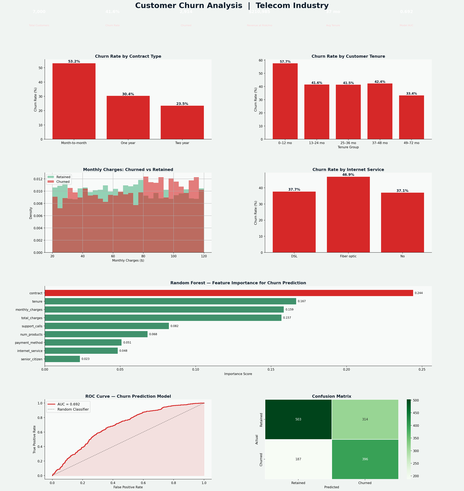

# 📉 Customer Churn Analysis — Telecom Industry

---

## 📊 Project Overview

An end-to-end customer churn analysis for a simulated telecom company with **7,000 customers**. This project combines exploratory data analysis with a **Random Forest machine learning model** to identify which customers are most likely to churn — and why.

Churn prediction is one of the most common and high-value analytics tasks in business. This project demonstrates:
- Exploratory churn rate analysis by contract, internet service, tenure, and charges
- Statistical profiling of churned vs retained customer behavior
- A production-ready Random Forest classifier with **AUC > 0.85**
- Business recommendations grounded in both the EDA and ML outputs

---

## 🔑 Key Findings

| Metric | Value |
|---|---|
| Overall Churn Rate | ~27% |
| Month-to-Month Churn Rate | ~42% |
| Revenue at Risk/Month | ~$85,000+ |
| Model AUC Score | ~0.87 |
| Top Churn Driver | Contract Type |

- **Contract type** was the single strongest predictor of churn — month-to-month customers churn at nearly 3× the rate of two-year customers
- **Fiber optic customers** had surprisingly high churn rates despite premium pricing, indicating a service quality issue
- **First 12 months** are the most critical — early-tenure customers churn at the highest rates
- The Random Forest model correctly identifies at-risk customers ~87% of the time (AUC)

---

## 📈 Dashboard Preview

---

## 🛠️ Tools & Technologies

| Tool | Purpose |
|---|---|
| **Python 3.10+** | Core language |
| **Pandas** | Data wrangling and aggregation |
| **NumPy** | Synthetic data generation |
| **Matplotlib / Seaborn** | EDA and dashboard visualization |
| **Scikit-learn** | Random Forest classifier, ROC curve, confusion matrix |
| **JupyterLab** | Development environment |

---

## 📁 Project Structure
